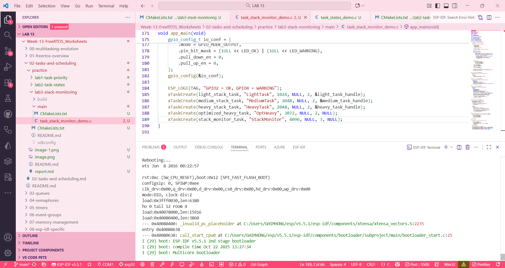
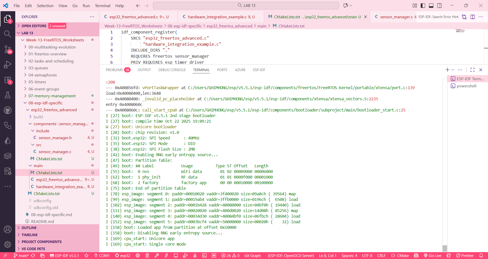
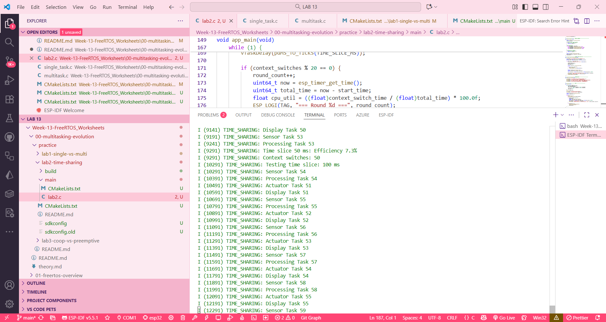
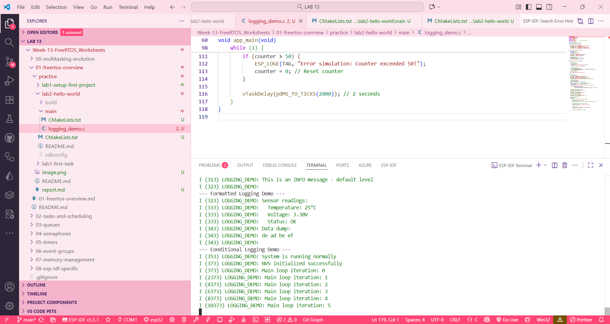

__00__
lab 1

lab 2

lab 3

__01__
lab 1

lab 2

lab 3

__02__
lab 1

lab 2

lab 3

__03__
lab 1

lab 2

lab 3

__04__
lab 1

lab 2

lab 3

__05__
lab 1

lab 2

lab 3

__06__
lab 1

lab 2

lab 3

__07__