__00__

lab 1

lab 2

lab 3

__01__

lab 1

lab 2

lab 3

__02__

lab 1

lab 2
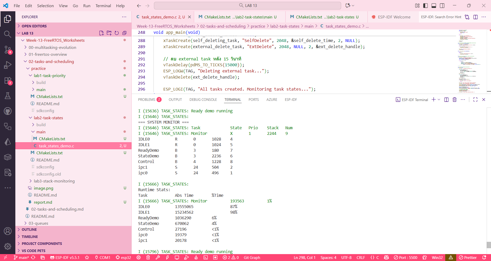

lab 3
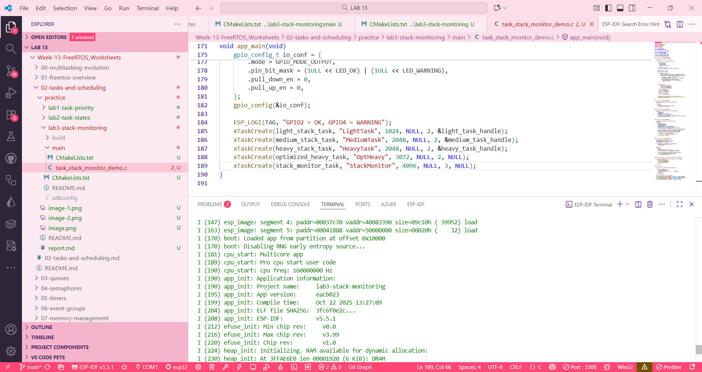

__03__

lab 1

lab 2
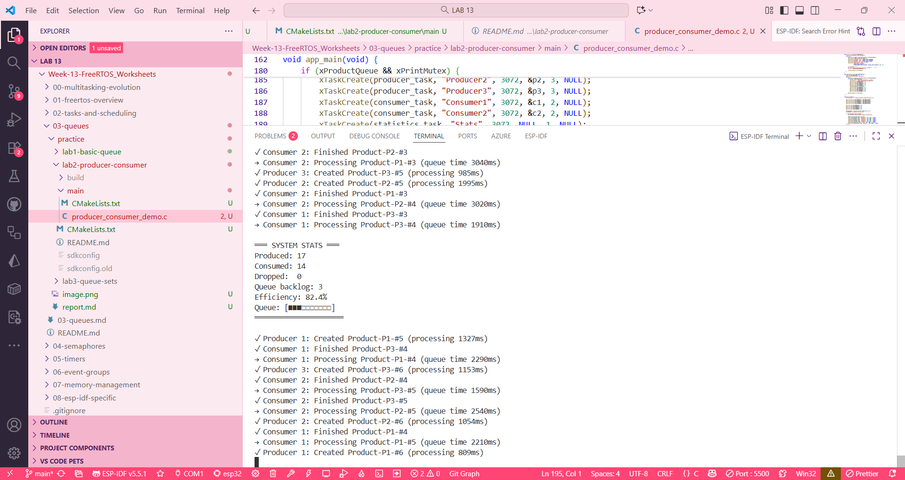

lab 3
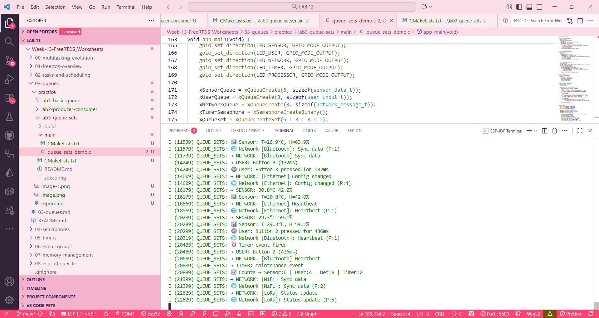

__04__

lab 1

lab 2
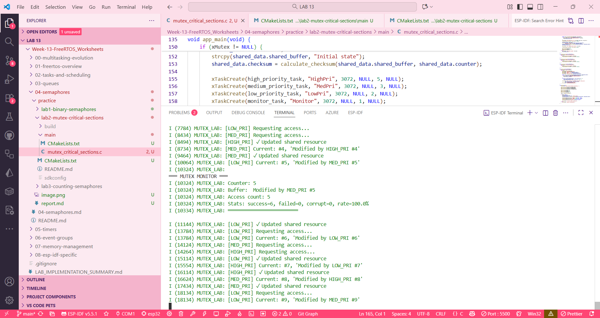

lab 3
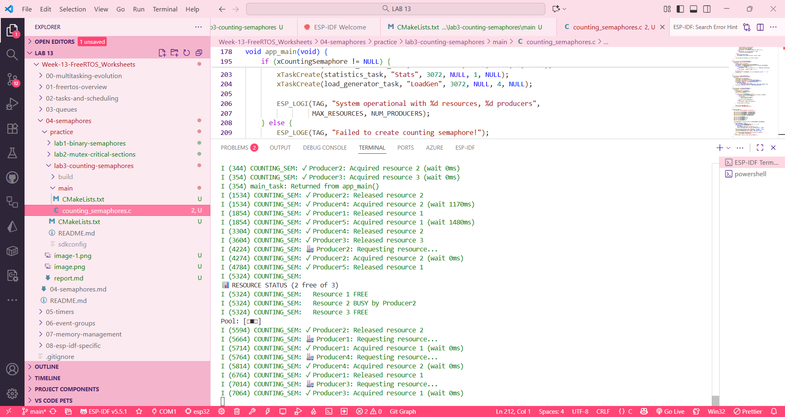

__05__

lab 1

lab 2
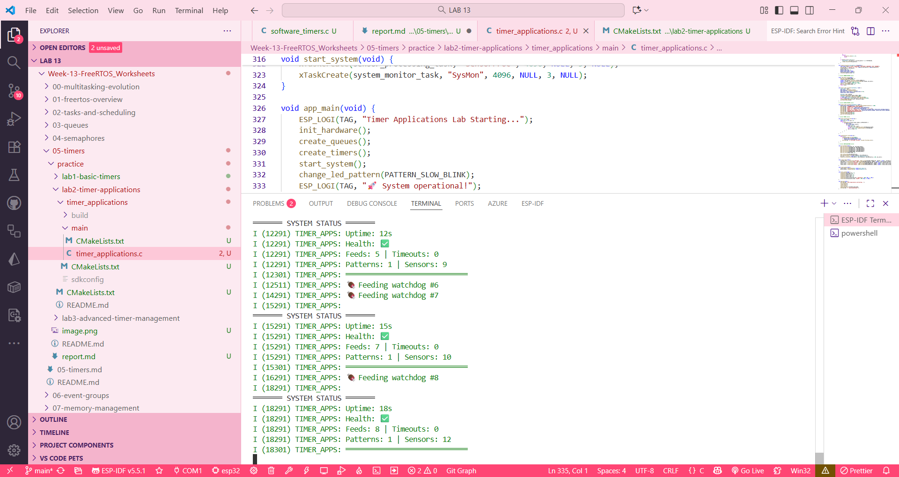

lab 3
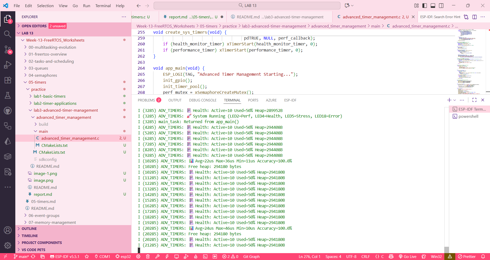

__06__

lab 1

lab 2
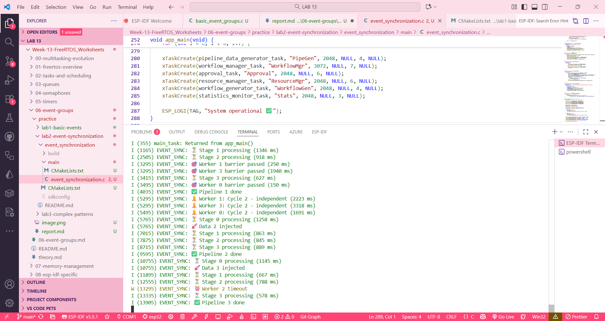

lab 3
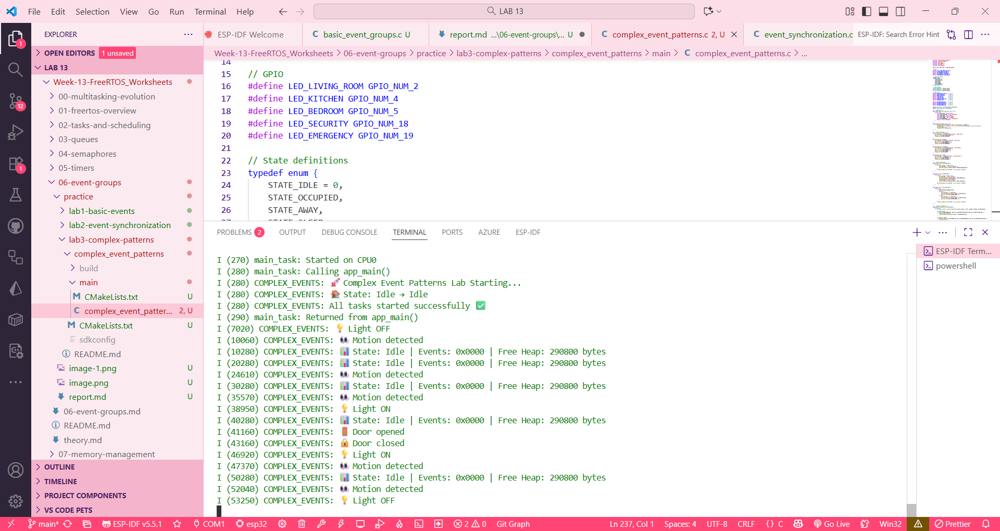

__07__

lab 1

lab 2
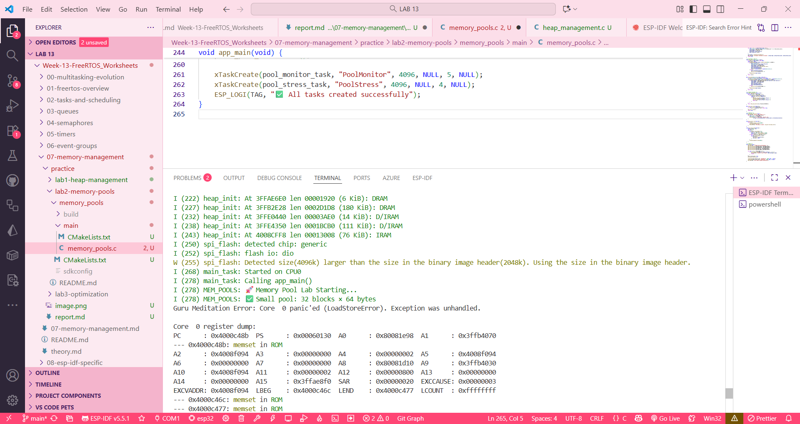

lab 3
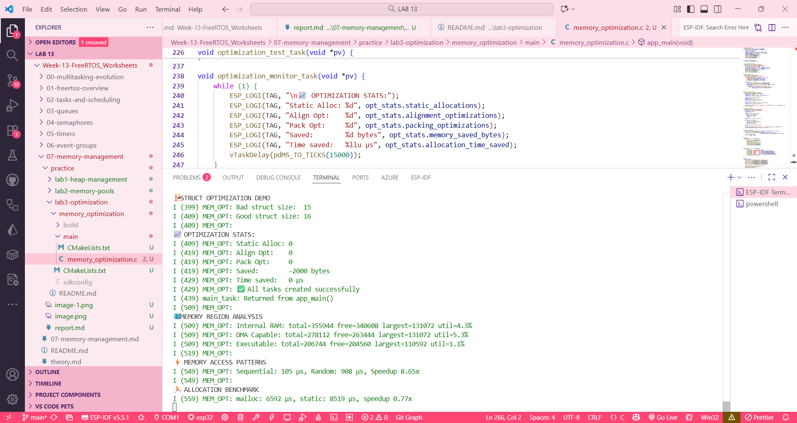

__08__

