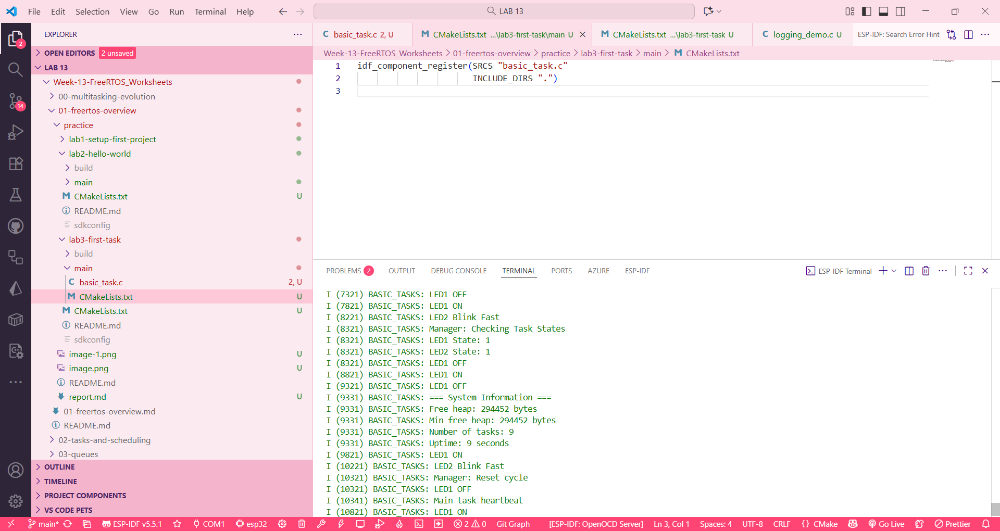

__00__

lab 1

lab 2

lab 3

__01__

lab 1

lab 2

lab 3

__02__

lab 1

lab 2

lab 3

__03__

lab 1

lab 2

lab 3

__04__

lab 1

lab 2

lab 3

__05__

lab 1

lab 2

lab 3

__06__

lab 1

lab 2

lab 3

__07__

lab 1

lab 2

lab 3

__08__

